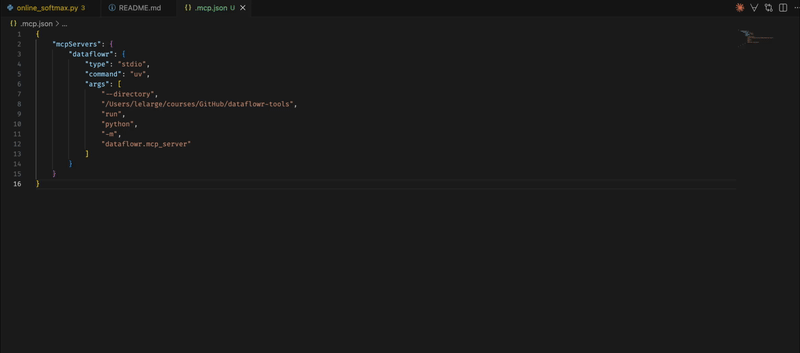

# dataflowr — CLI, API & MCP server for the Deep Learning DIY course

[](LICENSE)
[](https://pypi.org/project/dataflowr/)

The [Deep Learning DIY](https://dataflowr.github.io/website) course teaches PyTorch from scratch — tensors, autodiff, CNNs, RNNs, Transformers, VAEs, and diffusion models — through hands-on notebooks. Course resources:

- [dataflowr/notebooks](https://github.com/dataflowr/notebooks) — all practical notebooks (PyTorch fundamentals → diffusion models)
- [dataflowr/gpu_llm_flash-attention](https://github.com/dataflowr/gpu_llm_flash-attention) — implement FlashAttention-2 from scratch using Triton
- [dataflowr/llm_controlled-generation](https://github.com/dataflowr/llm_controlled-generation) — structured generation, meta-generation, and self-correction for LLMs

This package exposes the course as a CLI, REST API, and MCP server so AI agents can navigate and teach it.



## Quick start with Claude Code

Add a `.mcp.json` file at the root of your project (homework repo, notebook folder, etc.):

```json
{
  "mcpServers": {
    "dataflowr": {
      "type": "stdio",
      "command": "uv",
      "args": ["run", "--with", "dataflowr[mcp]", "python", "-m", "dataflowr.mcp_server"]
    }
  }
}
```

Claude Code picks this up automatically when you open the folder. No global install needed — `uv` downloads `dataflowr[mcp]` on first use.

To pre-approve all dataflowr tools (no per-call prompts), also add `.claude/settings.json`:

```json
{
  "permissions": {
    "allow": ["mcp__dataflowr"]
  }
}
```

---

## Install

```bash
# with uv (recommended)
uv pip install dataflowr          # CLI only
uv pip install dataflowr[api]     # CLI + REST API
uv pip install dataflowr[mcp]     # CLI + MCP server
uv pip install dataflowr[all]     # everything

# with pip
pip install dataflowr
pip install dataflowr[mcp]
```

Or from source:
```bash
git clone https://github.com/dataflowr/dataflowr-tools
cd dataflowr-tools
uv pip install -e ".[all]"
```

---

## CLI

```bash
# Course overview
dataflowr info

# List all modules
dataflowr modules list

# Filter by session, tag, or GPU requirement
dataflowr modules list --session 7
dataflowr modules list --tag attention
dataflowr modules list --gpu

# Full module details (with notebook links)
dataflowr module 12

# Fetch notebook content from GitHub
dataflowr notebook 12                        # practical (default)
dataflowr notebook 12 --kind intro
dataflowr notebook 12 --no-code              # markdown only

# Fetch course website page text (raw markdown from dataflowr/website)
dataflowr page 12

# Fetch lecture slides (from dataflowr/slides)
dataflowr slides 12

# Fetch quiz questions (from dataflowr/quiz)
dataflowr quiz 2a
dataflowr quiz 3

# Compare catalog against website + slides repos
dataflowr sync

# Search by keyword
dataflowr search "attention transformer"
dataflowr search "generative"

# Sessions
dataflowr sessions list
dataflowr sessions get 7

# Homeworks
dataflowr homeworks list
dataflowr homeworks get 1

# JSON output (pipe-friendly)
dataflowr modules list --json | jq '.[] | select(.session == 9)'
dataflowr module 18b --json
```

---

## REST API

```bash
uvicorn dataflowr.api:app --reload
# → http://localhost:8000
# → http://localhost:8000/docs  (Swagger UI)
```

Endpoints:

| Method | Path | Description |
|--------|------|-------------|
| GET | `/` | Course overview |
| GET | `/modules` | List all modules (`?session=`, `?tag=`, `?gpu=`) |
| GET | `/modules/{id}` | Get module by ID |
| GET | `/modules/{id}/notebooks` | Get notebooks for a module (`?kind=`) |
| GET | `/modules/{id}/notebooks/{kind}/content` | Fetch notebook cells from GitHub (`?include_code=`) |
| GET | `/modules/{id}/slides` | Fetch lecture slide content from dataflowr/slides |
| GET | `/modules/{id}/quiz` | Fetch quiz questions from dataflowr/quiz |
| GET | `/modules/{id}/page` | Fetch module source markdown from dataflowr/website |
| GET | `/catalog/sync` | Compare catalog against website + slides repos |
| GET | `/sessions` | List all sessions |
| GET | `/sessions/{n}` | Get session with modules |
| GET | `/homeworks` | List all homeworks |
| GET | `/homeworks/{id}` | Get homework by ID |
| GET | `/search?q=...` | Search modules |

Examples:
```bash
curl http://localhost:8000/modules/12
curl http://localhost:8000/sessions/7
curl http://localhost:8000/search?q=diffusion
curl "http://localhost:8000/modules?session=9&gpu=true"
curl "http://localhost:8000/modules?tag=attention"
curl "http://localhost:8000/modules/12/notebooks/practical/content?include_code=false"
curl http://localhost:8000/modules/12/page
curl http://localhost:8000/modules/2a/quiz
curl http://localhost:8000/modules/3/quiz
```

---

## MCP Server (for AI agents)

Makes the course natively available to Claude, Cursor, VS Code, and other MCP-compatible agents.
Built on the [official MCP Python SDK](https://github.com/modelcontextprotocol/python-sdk) (FastMCP).

### Stdio transport (local — Claude Desktop, Cursor, VS Code, Claude Code)

```bash
python -m dataflowr.mcp_server
```

### HTTP transport (remote / shared deployments)

```bash
python -m dataflowr.mcp_server --http
# → POST http://localhost:8001/mcp  (or $PORT if set)
```

---

### Client configuration

#### Claude Code (VSCode extension or CLI)

Add a `.mcp.json` file at the **root of your project** (homework repo, notebook folder, etc.):

```json
{
  "mcpServers": {
    "dataflowr": {
      "type": "stdio",
      "command": "uv",
      "args": ["run", "--with", "dataflowr[mcp]", "python", "-m", "dataflowr.mcp_server"]
    }
  }
}
```

Claude Code picks this up automatically when you open the folder. No global install needed — `uv` downloads `dataflowr[mcp]` on first use.

To pre-approve all dataflowr tools (no per-call prompts), also add `.claude/settings.json`:

```json
{
  "permissions": {
    "allow": ["mcp__dataflowr"]
  }
}
```

Or register globally (available in every project):

```bash
claude mcp add --scope user dataflowr -- uv run --with dataflowr[mcp] python -m dataflowr.mcp_server
```

#### Claude Desktop

Edit `~/.claude/claude_desktop_config.json` (macOS/Linux) or `%APPDATA%\Claude\claude_desktop_config.json` (Windows):

```json
{
  "mcpServers": {
    "dataflowr": {
      "command": "python",
      "args": ["-m", "dataflowr.mcp_server"]
    }
  }
}
```

With `uv` (no global install needed):
```json
{
  "mcpServers": {
    "dataflowr": {
      "command": "uv",
      "args": ["run", "--with", "dataflowr[mcp]", "python", "-m", "dataflowr.mcp_server"]
    }
  }
}
```

#### Cursor

Edit `.cursor/mcp.json` at the root of your project (or `~/.cursor/mcp.json` globally):

```json
{
  "mcpServers": {
    "dataflowr": {
      "command": "python",
      "args": ["-m", "dataflowr.mcp_server"]
    }
  }
}
```

#### VS Code

Edit `.vscode/mcp.json` at the root of your project:

```json
{
  "servers": {
    "dataflowr": {
      "type": "stdio",
      "command": "python",
      "args": ["-m", "dataflowr.mcp_server"]
    }
  }
}
```

#### Remote / HTTP

If running with `--http`, point clients at the URL:

```json
{
  "mcpServers": {
    "dataflowr": {
      "url": "http://localhost:8001/mcp"
    }
  }
}
```

---

### Recommended workflow

```
1. search_modules "attention"      → find relevant modules by keyword
2. get_module "12"                 → full details, notebook links, prerequisites
3. get_page_content "12"           → read the lecture notes
4. get_notebook_content "12"       → work through the exercises
5. get_quiz_content "12"           → self-test your understanding
```

For a personalised study plan, use the **`learning_path`** prompt with a target module.

---

### Tools exposed to the agent

| Tool | Description |
|------|-------------|
| `list_modules` | List modules, filterable by session / tag / GPU |
| `get_module` | Full details for a module |
| `search_modules` | Keyword search across titles, descriptions, and tags |
| `list_sessions` | List all sessions |
| `get_session` | Session + all module content |
| `get_notebook_url` | GitHub/Colab links for a notebook |
| `list_homeworks` | All homeworks |
| `get_homework` | Full details for a homework |
| `get_slide_content` | Fetch lecture slides from dataflowr/slides |
| `get_quiz_content` | Fetch quiz questions from dataflowr/quiz |
| `check_quiz_answer` | Validate a student's quiz answer |
| `get_notebook_content` | Fetch actual notebook cells from GitHub |
| `get_notebook_exercises` | Fetch only exercise prompts + skeleton code |
| `get_page_content` | Fetch module source markdown from dataflowr/website |
| `get_course_overview` | Full course structure as context |
| `get_prerequisites` | Prerequisite modules for a given module |
| `suggest_next` | What to study after completing a module |
| `sync_catalog` | Compare catalog against website + slides repos |

### Prompts exposed to the agent

| Prompt | Arguments | Description |
|--------|-----------|-------------|
| `explain_module` | `module_id` | Tutoring session — Socratic explanation of a module |
| `quiz_student` | `module_id` | Interactive quiz, one question at a time |
| `debug_help` | `module_id` | Guided debugging help for a practical notebook |
| `learning_path` | `target_module_id`, `known_modules` | Personalised prerequisite chain to a target module |

---

### Example questions

Once connected, an agent can answer questions like:

- *"What should I study before tackling diffusion models?"*
- *"Give me the Colab link for the microGPT notebook."*
- *"Which session covers attention mechanisms?"*
- *"What are all the generative modeling modules?"*
- *"Show me the Flash Attention homework tasks."*
- *"Quiz me on Module 3 — loss functions."*
- *"I'm stuck on the backprop exercise in Module 2b. Help me debug it."*
- *"Build me a learning path to Module 18b (diffusion models) starting from scratch."*

---

## Python API

```python
from dataflowr import COURSE

# Get a module
module = COURSE.get_module("12")
print(module.title)          # "Attention and Transformers"
print(module.description)
print(module.notebooks)

# Search
results = COURSE.search("attention")

# Get a session
modules = COURSE.get_session_modules(7)

# Navigate the full catalog
for module in COURSE.modules.values():
    if module.requires_gpu:
        print(f"Module {module.id}: {module.title}")
```

---

## Design principles

- **Content only, no execution.** The package exposes the course structure and links. Running notebooks stays in the student's hands.
- **Agent-friendly.** All outputs are text-first. The MCP server renders markdown so agents can use it directly in responses.
- **No external dependencies for core.** The catalog, models, and CLI work with only `pydantic`, `typer`, and `rich`. The API needs `fastapi`; the MCP server needs `mcp`.
- **Single source of truth.** `catalog.py` is the only place that needs updating when the course evolves.
